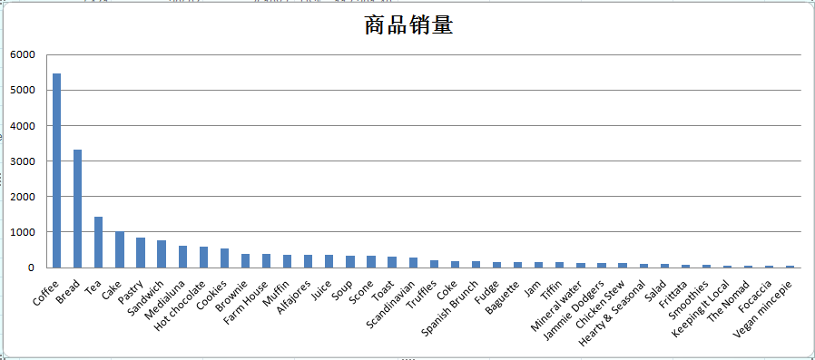
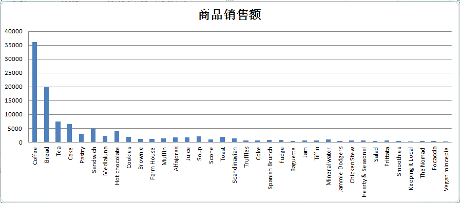
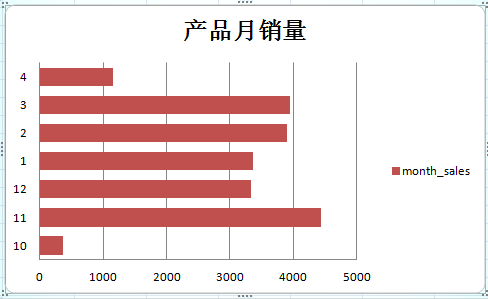
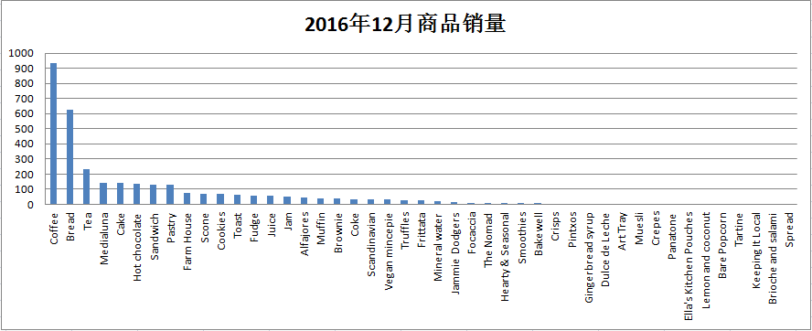
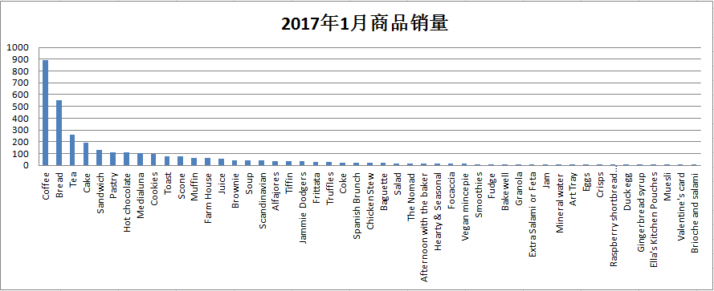
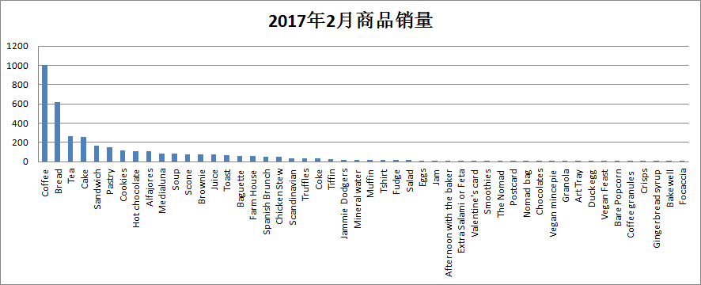

# 网红咖啡店的商业决策

这篇分析报告是为某网红咖啡店的运营给出的咨询建议，整篇报告将按照标准的CRISP-DM分析框架进行分析。具体包含六个部分：

1. 业务问题
2. 数据理解
3. 数据准备
4. 分析和建模
5. 模型评估
6. 建议的决策

## 一. 业务问题

这篇分析报告要集中回答的一个核心业务问题是：如何给这家咖啡厅制定适合它自身特色的经营策略，以便在未来得到更好的发展？

要回答这样的问题，我们要做出的决策包括：
1. 咖啡厅是否可以在不同的月份推出不同的热销产品？
2. 咖啡厅是否可以在每天不同时段推出不同的产品和服务？
3. 咖啡厅是不是可以推出热卖商品的套餐组合？

要支持上面的决策，需要了解如下信息：
1. 不同商品的总销售额和销量
2. 每月商品总销量
3. 不同商品月销量
4. 每小时商品销量
5. 销售订单中商品组合频繁出现的项

对于前5条信息，我们可以采用非预测分析方法来采集数据获取信息，主要就是数据的各种聚合运算；对于第6条信息，需要采用Apriori算法进行关联规则挖掘分析，以挖掘可能存在的频繁项集，需要通过编程实现，会进行单独处理。

## 二. 数据理解和准备

要计算销售额，需要产品的单价以及销量数据。要计算商品组合项，需要订单明细数据。这些数据项目已经提供，并且是有效的。另外，项目提供的电子表格数据和SQL数据都很规范，数据已经做了必要的清理和格式化，因此本项目可以直接进入分析和建模阶段。

## 三. 分析和建模

### 1. 不同商品总销售额和销量



咖啡厅在半年内总共卖出20507份商品，总销售额为US$113,201.40，上面两个统计图表只统计了销量大于50的商品。可以看到，咖啡厅卖的最好的前5名是咖啡，面包，茶，蛋糕和点心。其中咖啡，面包和茶的销量都超过了1000份。咖啡，面包，茶和蛋糕的销售额超过US$5,000，属于热卖产品。

### 2. 每月商品总销量

查询月总销量：
```SQL
SELECT month, SUM(CAST(sales_volume AS INT)) month_sales
FROM month_item_sales
GROUP BY month
ORDER By month
```



2016年10月和2017年4月的数据记录不全，可以忽略。那么从2016年11月到2017年的3月，11月销量最高，12月和1月两个月份销量最低，然后在2月和3月有所上升，接近4000。

### 3. 不同商品月销量

查询不同商品月销量：
```SQL
SELECT month, item, SUM(CAST(sales_volume AS INT)) month_sales
FROM month_item_sales
GROUP BY month, item
ORDER BY month, month_sales DESC
```







去掉数据不全的10月和4月，只看11月到3月的数据，可以发现每个月热卖的商品基本上就是那几个常见的，而12月和1月所有商品的销量都不足1000。

### 4. 每小时商品销量

查询每小时商品销量：
```SQL
SELECT hour, SUM(CAST(sales_volume AS INT)) hour_sales
FROM hour_item_sales
GROUP BY hour
ORDER BY hour;
```


从上图可以看出咖啡厅每天售卖商品的高峰期为早上8点以后到下午17点以前，在中午11点左右达到顶峰。

## 四. 模型评估
## 五. 建议的决策