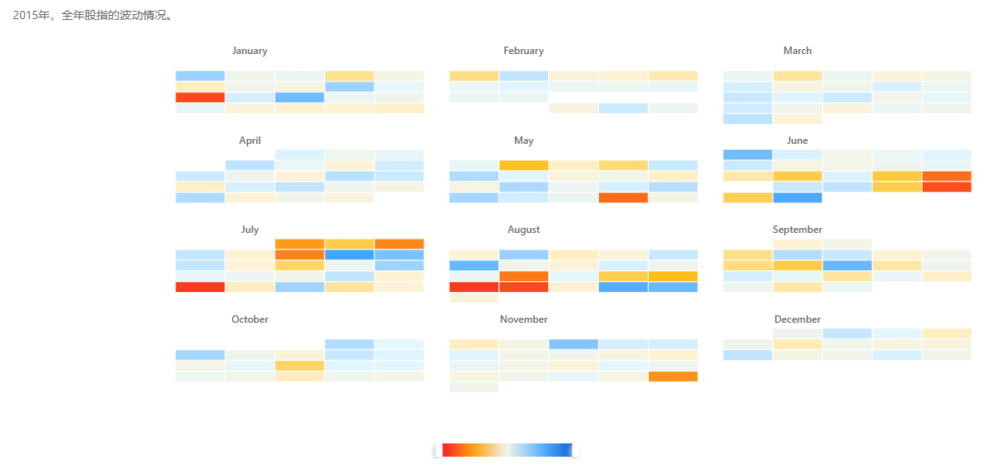
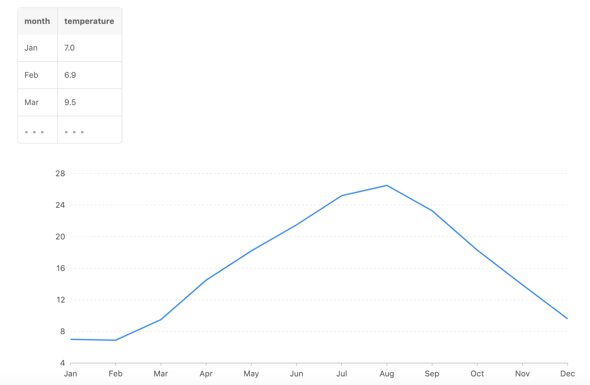
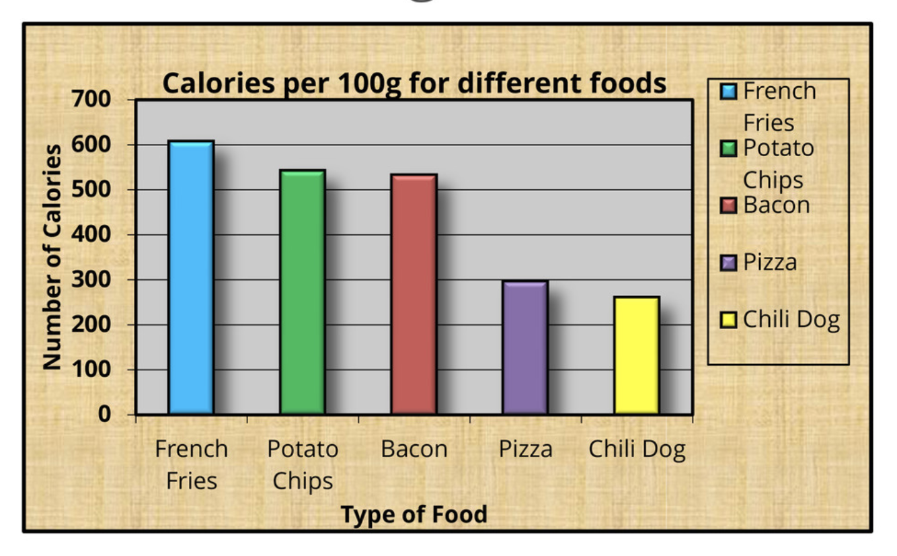
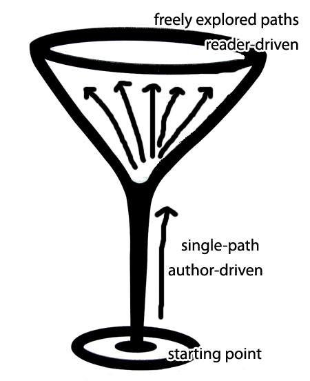

# 数据可视化入门

数据可视化是数据科学庞大知识体系的一个重要的组成部分。是数据科学成果最终呈现在世人面前的表现形式。因此它发挥的关键作用是不言而喻的。数据可视化（Data Visualization）是将非数字的信息进行可视化以表现抽象或复杂概念、技术和信息的过程。它将数据用各种形式的图表进行呈现，从而传递和展示信息。这篇学习笔记将对数据可视化进行一个简明扼要的介绍，带领大家理解并掌握如何解读数据可视化，如何通过可视化有效地传递信息，以及对于数据可视化的一些思考。

## 一. 如何解读数据可视化

我们可以把数据可视化看作是“数据空间”向“图形空间”的映射。数据所蕴含的信息以各种图表元素的形式展现了出来。常用的解读数据可视化的4种方法有：比大小，看长短，辨深浅，明趋势。

### 1. 比大小

视觉编码中的“面积/体积”常常被用来编码数据的某些数值特征，例如下图展示了某年美国各州发生的抢劫案件数目，抢劫案发生的次数就被编码成了图中“气泡”的大小，气泡越大发生的抢劫案越多，从图中可以看到发生次数最多的是Maryland，这种图叫做气泡地图（Bubble Map）。

### 2. 看长短

人眼对于长度的感受往往是最准确的，因此在可视化图表中长度也是一个很常见的视觉编码元素。这个经常用在一些比较类的图表中，特别是对数据进行计数统计的场景。其中柱状图是最常见的一种：

上图统计了不同种类游戏的销量，通过看长短的方式，一眼就能看出体育类游戏销量最高，其次是即时战略类游戏。另一种需要看长短的图表是直方图，它和柱状图看起来很像，但我们一定要知道它们的区别：柱状图用于统计**分类变量的计数**，比如上面不同类型游戏各自的销量。而直方图是用来展现**连续数值变量的分布**：它首先划分了不同的数据范围，我们称为“分箱”（bins），然后对落在不同分箱中的数据进行计数。例如下图展示了鸢尾花花萼长度的分布，从这个直方图中我们至少可以观察到3点：

1. 花萼长度的分布大概在4到8之间；
2. 花萼长度在5.5左右的属种数量最多；
3. 和柱状图不同的是，直方图各分箱之间没有间隔，表示数值数据是连续的；

### 3. 辨颜色

可能对于大多数可视化来说，最容易引起注意的就是图表中出现的颜色了。颜色在数据可视化中也扮演了重要的作用。一般来说，数据可视化都是二维的，如果我们要表示更多维度的信息，除了上面提到的长度和面积以外，最常用的就是颜色了。对于分类变量，我们可以把不同的类别编码为不同的颜色；对于连续型数值变量，我们可以把数值编码为色谱（color spectrum），用颜色的变化表示数值的变化。比如下面这个图展示了2015年，全年股指的波动情况。该图将某月的星期几映射到x轴，第几个星期映射到y轴，股指映射到颜色，从冷色调的蓝到暖色调的红，表示股指从低到高，并按照全年12个月进行分面（facets）。

### 4. 明趋势

数据点在图表中所处的位置往往也暗示了想要表示的信息。我们可以从这样的图表中读取数据的变化趋势信息，这在分析某时间段内数据趋势或变化时很常见，比如下面这个折线图分析了不同月份气温的变化趋势，可以看到气温从一月开始慢慢上升，到八月后九月前达到顶峰，随后开始下降，一直到12月。

### 5. 视觉编码：图表要传递的信息

以上介绍的只是众多视觉编码中的4种而已，按照有效性从高到低的顺序排列，常见的视觉编码有：

1. 位置
2. 长度
3. 弧度
4. 方向
5. 面积/体积
6. 形状
7. 色彩和饱和度

## 二. 如何有效地传递信息

数据可视化的目的是为了传递信息，要正确的传递信息，首先是根据要展示的信息选择合适的图表。在绘制图表的过程中我们还要注意一些设计方法和技巧，最后，我们应该把所有的图表集合起来，以一种有效的方式串联成一个故事讲给读者听。

### 1. 选择图表类型

用简单的三个步骤就可以选择合适的图表类型：一看数据类型，二看数据维度，三看要表达的内容。

我们有两种数据类型，每种数据类型又有两个子类别。首先，我们有**分类数据**和**定量数据**。分类数据用来表示类别，比如苹果，香蕉，梨子和葡萄，就是水果的4种类别，称为**分类定类**；有的分类变量是有一定顺序的，比如可以把红酒的品质分为低，中，高三档，人的身材有偏瘦，正常和肥胖等等，这种特殊的分类变量称为**分类定序**。定量数据也可以进一步分为两类，一类叫**连续值数据**，比如人的年龄；一类叫**离散值数据**，比如猫咪的数量。选择图表的第一步就是要看我要展示的数据是什么类型，最典型的例子就是相关性分析，如果要分析定量数据和定量数据之间的关系，那么散点图无疑是最佳选择，但如果有其他情况出现该怎么选择呢？数据类型直接影响你能选择的图表类型：

* 分析分类数据和分类数据之间的相关性：马赛克图
* 分析分类数据和定量数据之间的相关性：柱形图或箱线图

看完了数据类型，接着看维度，要展示的数据是一维，二维还是多维的？如果是一维或者二维，那么一般的统计图表都能满足要求，但如果我们有多维的数据，我们就要把第三维开始的数据映射到上面提到的那7大视觉编码中。比如散点图表示了两个定量数据之间的关系，如果还存在第三个定量数据，那么我们就可以用点的大小来表示，那么散点图就变成了气泡图，如果第三个数据是分类数据，那么我们可以在散点图的基础上标记颜色来表示。

最后，还要考虑可视化主要想表达的内容是什么。对于4大内容：比较，分布，组合和关系，下面这张图给出了一份简单的指南。比如我想表达的是数据的分布，如果是单变量且只有比较少的数据点时，可以选择直方图。

### 2. 少即是多：数据墨水比

选择了正确的图表并绘制完成，下一步我们要做的就是对绘制的图表进行检查：它是否有效的传递了信息？评判的标准叫做数据墨水比（data-ink ratio），即用于描述数据的墨水量/用于描述所有其他东西的墨水量。这里的墨水量可以理解为使用的视觉编码元素量。数据墨水比越高表示图表越有效，说明图表中用来描述数据的视觉编码数量占比很高，反之则很低。比如下面这张图：

这个图表充斥了大量无效的视觉特效：各种纹理，背景，立体阴影效果以及字体加粗，花费了大量的墨水用在与传达信息无关的视觉编码上。使读图的人无法快速地获取图表想要表达的信息，数据墨水比非常的低。而经过改造之后，我们去掉了各种纹理背景，去掉了各种坐标轴，直接将数值显示在柱状图上，然后对文字进行淡化，并用颜色突出显示我们想要读者一眼就看到的类别（培根），去掉了一切立体和阴影的效果，得到的图表如下所示，怎么样，是不是比上面这个图表要清晰很多呢？Less is more effective!

最后要提醒大家的一点是，使用颜色一定要小心，你要充分的考虑数据可视化的受众，比如红色和绿色对于红绿色盲的患者就是很不友好的。

### 3. 超越单图：怎样做一个Storyteller

绘制完图表，我们的数据可视化的任务只完成了一半。因为任何数据可视化都是由一系列的图表构成的，它们放在一起讲了一个“故事”。制作者就是一个Storyteller，通过给受众讲故事，数据可视化的信息就被传达了出来。那么这个以数据为中心的故事要以什么形式展开呢？有三种形式：作者驱动型，读者驱动型以及“马提尼酒杯型”。

如果阅读数据可视化的方式和顺序已经被作者预先设定好了，读者只能按照这一预先设定来进行，那么就称为作者驱动型的叙事结构。一般来说，这类数据可视化都有明确的开头和结尾，通过一个播放按钮或者按顺序组织的页码标签，读者点击播放或者按顺序一页一页的显示，就能按照作者预设的线性化的思路完成对整个数据可视化的解读。比如关于[Facebook IPO](https://archive.nytimes.com/www.nytimes.com/interactive/2012/05/17/business/dealbook/how-the-facebook-offering-compares.html)这个可视化图表就是典型的作者驱动型。通过点击上面的按钮，读者可以像放幻灯片一样以严格的顺序阅读关于Facebook首次公开募股有关信息，每个阶段都能看到数据的延伸和转换。

反过来，如果数据可视化有明确的开头，但给予读者很大的自由去探索数据，与数据自由互动，提出问题，探索故事进展并有机会讲述自己的发现。那么这种数据可视化就是读者驱动型的。[Marid In Detail](https://public.tableau.com/en-us/s/gallery/madrid-details?gallery=featured)和[LinkedIn Top Skills 2016](https://public.tableau.com/profile/matt.chambers#!/vizhome/LinkedInTopSkills2016-MakeoverMonday/LinkedInTopSkills2016-MakeoverMonday)就属于这种类型的可视化：没有任何预先的设定，读者通过自己点击面板上的可视化元素完成解读，每个人解读的方式不一样，得到的结论也就丰富多彩，各有千秋。

最后，我们可以把作者驱动型和读者驱动型结合起来，构造更复杂的叙事结构，称为[马提尼酒杯型](https://mastersofmedia.hum.uva.nl/blog/2011/05/03/narrative-structures-in-data-visualizations-to-improve-storytelling/)叙事结构，这种叙事结构跟上面两种一样，有一个明确的开头。但首先读者要沿着作者预设的单一路径进行阅读，随后当这一过程结束时，读者会开始他们自己的自由探索，就像下面这个图展示的一样：

所以数据可视化既是一门艺术，又是一门技术。既要有数据分析的理性思考，又要有设计美学的审美意识。你做好接受挑战的准备了吗？

## 三. 一些思考

迈阿密大学教授Alberto Cairo提出，一个好的数据信息的表达应该遵循以下5个原则：**真实的**，**有用的**，**优美的**，**有见地的**，和**有启发性的**。

### 1. 真实的（Truthful）

> 第一条原则，你不能欺骗你自己，你是最容易被骗的人。 ——美国物理学家理查德费曼

我们常常容易犯两个错误。一旦有了一个观点或假设，就会竭尽全力的去寻找能支持这个观点的证据，却选择性的忽视否定这个观点的证据，又或者当反对观点出现的时候，我们总会本能的先开始反驳，而不是先考虑其合理性。为了观点而做的可视化是有偏见的，带着观点去解读可视化同样也是有偏见的。除非我们能找到一些数据来佐证我们的观点，否则就不能说“我觉得有就是有”，比如如果问你运动员签了大合同后是否会影响其竞技水平？当然不能说我觉得有不少球员签了大合同后就废了，然后再找一些例子来佐证这个观点。而应该是首先明确多大金额的算是大合同，然后把所有签了这些合同的球员列出来。选择多个综合指标去比较这些球员在签订合同前后的几年间的表现。而且还要排除伤病影响的，是否中间更换过球队，出场时间差别是否过大等等。

### 2. 有用的（Functional）

比如问一个问题：这个周末商场促销的效果如何？如果只是得出结论促销过程中销售额增长了60%，单看是正确的，但是是不是有用呢？其实没用，而且还有误导的嫌疑。要做到有用，是不是应该包含销售额增长来自哪部分商品？是仅仅来自促销商品？还是也带动了其他商品的销售？ 周末促销是不是应该考虑平时的销售额也是增长的，实际的增长是不是可能没有60%那么高？在停止促销后的几周里，是不是比促销前的几周也做到了持续增长？深入分析并回答了这些问题，我们才应该算是正确回答了“促销是不是达到了效果?”这个问题，这才算是有用的。

### 3. 优美的（Beautiful）

数据可视化要简洁明了，关键是要把不包含信息的元素去掉，把信息冗余的部分合并掉，用比较优雅的方式表现。数据墨水比越高的可视化图表越优美。

### 4. 有见地的（Insightful）

信息图是为了给人阅读的，要表达出观点，而不只是给人看看就结束了。不光要表达出来，而且最好是有意义.  而不是让人一看，哇好酷炫！却得不出任何有意义的结论。当然在重点要表达的地方可以用文字，或者其他特别的方式标注出来，方便听众或读者迅速的提取信息。

### 5. 有启发性的（Enlightening）

做好了前面的4点，我们的数据可视化就是有启发性的。通过数据可视化，读者了解了数据背后发生的原因，以及对未来可能产生的影响。以上就是Alberto所说的关于信息图的五个原则：真实的，有用的，优美的，有见地的，和有启发性的。

数据科学的主要组成部分包含三个大的阶段：数据整理，探索性数据分析和数据可视化。站在一个更高的位置来看，数据可视化在数据科学中的位置是比较靠后的，是属于最后的成果展示阶段。如果要从头说起的话，首先，在**数据整理**阶段，我们的主要任务是数据的获取和解析，包括一系列对原始数据的清洗和加工工作，这一块的知识领域主要涉及计算机科学。紧接着是**探索性数据分析**阶段，这个阶段要大量使用统计和数据挖掘方面的专业知识，也需要绘制图表来解释数据和探索数据，这个阶段的主要任务是过滤和挖掘。但这个阶段的可视化分析只是你和数据之间的“对话”，是数据想要告诉你什么，而数据可视化则是数据和你的读者之间的对话，是你通过数据想要告诉读者什么，这是它们之间最大的区别。完成了上面两个阶段的内容，才到了我们最后的**数据可视化**阶段，这是一个多学科交叉的领域，涉及到图形设计，信息可视化和人机交互，我们的主要任务是对信息进行精炼，然后通过可视化表示出来，并与读者产生交互。然而，如果将数据科学的这三个阶段理解为按严格顺序进行的“线性”的模型那就大错特错了，它经历的是一个迭代的，非线性的过程。后面的步骤会让你更了解之前所做的工作，可能到了数据可视化阶段，才意识到还有太多疑点要弄明白，我们需要回到上一步重新进行之前的工作，就像画家翻来覆去才能最终完成一幅杰作一样，数据可视化的过程并不是给数据分析这个刚出炉的蛋糕加点糖霜，，而是有一个反复迭代，不断优化的过程。